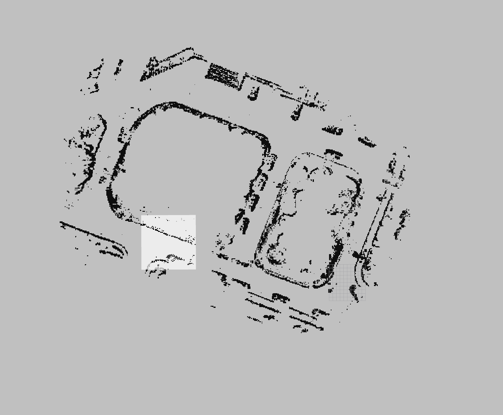

## GEM: Online Globally consistent dense elevation mapping for unstructured terrain

### NEW FEATURES !!!

**1. Multi-resolution map representation implemented with octomap**

**2. Submap point cloud upsample implemented by mls api in PCL**

**3. Add costmap api for exploration tasks**

**4. Add loop correction module (relative front-end is coming soon)**

This is a [ROS] package developed for elevation mapping with a mobile robot which is modified on [ANYbotics](https://www.anybotics.com/) Elevation Map method. This package further implements a GPU version of the point cloud process and a global mapping module. 

The software is designed for (local-global) navigation tasks with robots that are equipped with pose estimation (e.g. IMU & odometry) and a distance sensor (e.g. structured light (Kinect, RealSense), laser range sensor, stereo camera). The provided local elevation map is limited around the robot and reflects the pose uncertainty that is aggregated through the motion of the robot (robot-centric mapping). The global map is represented as several submaps corresponding to a pose provided by odometry. This method is developed to explicitly handle drift of the robot pose estimation.

The online Globally consistent dense Elevation Mapping (GEM) packages have been tested under ROS Kinetic and Ubuntu 16.04. This is research code, expect that it changes often and any fitness for a particular purpose is disclaimed.

**Author: Peter XU (Xuecheng XU), Yiyuan PAN 
Affiliation: [ZJU-Robotics Lab](https://github.com/ZJU-Robotics-Lab) 
Maintainer: Peter XU, xuechengxu@zju.edu.cn **

This project was developed at Zhejiang University (Robotics Lab, College of Control Science and Engineering).

## Loop Performance (Loop version is now available)

## Costmap

## Video

## Citing

The online globally consistent elevation mapping methods used in this software are described in the following paper (available [here]). If you use this work in an academic context, please cite the following publication(s):

* > Y Pan, X. Xu, Y Wang, X Ding and R Xiong,
  > **"GPU accelerated real-time traversability mapping"**,
  > in 2019 IEEE International Conference on Robotics and Biomimetics (ROBIO), 734-740 ([PDF](https://ieeexplore.ieee.org/abstract/document/8961816))

      @inproceedings{pan2019gpu,
        title={GPU accelerated real-time traversability mapping},
        author={Pan, Yiyuan and Xu, Xuecheng and Wang, Yue and Ding, Xiaqing and Xiong, Rong},
        booktitle={2019 IEEE International Conference on Robotics and Biomimetics (ROBIO)},
        pages={734--740},
        year={2019},
        organization={IEEE}
      }
  
* > Y Pan, X. Xu, X Ding, Shoudong Huang, Y Wang, and R Xiong,
  > **"GEM: Online Globally Consistent Dense Elevation Mapping for Unstructured Terrain"**,
  > **Published in:** [IEEE Transactions on Instrumentation and Measurement](https://ieeexplore.ieee.org/xpl/RecentIssue.jsp?punumber=19) ( Volume: 70)([PDF](https://ieeexplore.ieee.org/document/9293017))

      @ARTICLE{9293017,  
      author={Y. {Pan} and X. {Xu} and X. {Ding} and S. {Huang} and Y. {Wang} and R. {Xiong}},  
      journal={IEEE Transactions on Instrumentation and Measurement},   
      title={GEM: Online Globally Consistent Dense Elevation Mapping for Unstructured Terrain},   
      year={2021},  
      volume={70},  
      number={},  
      pages={1-13},  
      doi={10.1109/TIM.2020.3044338}}
## Installation

### Dependencies

This software is built on the Robotic Operating System ([ROS]), which needs to be [installed](http://wiki.ros.org) first. Additionally, the Globally consistent dense Elevation Mapping depends on following software:

- [Grid Map](https://github.com/anybotics/grid_map) (grid map library for mobile robots)
- [kindr](http://github.com/anybotics/kindr) (kinematics and dynamics library for robotics),
- [kindr_ros](https://github.com/anybotics/kindr_ros) (ROS wrapper for kindr),
- [Point Cloud Library (PCL)](http://pointclouds.org/) (point cloud processing),
- [Eigen](http://eigen.tuxfamily.org) (linear algebra library, tested on 3.2.9 & 3.3.4; failed on 3.3.9).
- [CUDA](https://developer.nvidia.com/cuda-toolkit-archive) (gpu process)
- [slam_msg](https://github.com/ZJU-Robotics-Lab/slam_msg) (msg need for detected loops)
- cudnn (pay attention to the version: CUDA 10.0 -> cudnn 7.4; CUDA 10.1 -> cudnn 7.6)

### Building

In order to install the GEM, clone the latest version from this repository into your catkin workspace and compile the package using ROS.

    cd catkin_workspace/src
    git clone https://github.com/ZJU-Robotics-Lab/GEM.git
    git clone https://github.com/ZJU-Robotics-Lab/slam_msg.git
    git clone https://github.com/ANYbotics/kindr_ros.git
    cd ../
    catkin_make

## Basic Usage

In order to get the GEM to run with your robot, you will need to adapt some parameters. It is the easiest if duplicate and adapt all the parameter files that you need to change from the `elevation_mapping_demos` package (e.g. the `simple_demo` example). These are specifically the parameter files in `config` and the launch file from the `launch` folder.

    roslaunch filter.launch
    roslaunch elevation_mapping_demos simple_demo.launch

## Simple Demo

You can get our demo bag from this link: https://drive.google.com/file/d/1hv3ovZnAVSpL0T6GZkJQ14Ptm4w_1ALc/view?usp=sharing

    rosbag play test.bag --clock --pause
    roslaunch filter.launch
    roslaunch elevation_mapping_demos simple_demo.launch
    # optional - if use costmap
    roslaunch pointMap_layer create_globalmap.launch 

## !!! An Important Thing

With different sensor configurations of coordination, you may change the filter line in cuda/gpu_process.cu https://github.com/ZJU-Robotics-Lab/GEM/blob/997d31b3b076076f26e72276fe83a43836d29331/elevation_mapping/elevation_mapping/cuda/gpu_process.cu#L393. The demo is recorded with PandarQT with x axis point to left and y axis point to back. In lidar with camera branch, we only use the point cloud in front of the robot.

## Nodes

### Node: elevation_mapping

This is the main GEM node. It uses the distance sensor measurements and the pose and covariance of the robot to generate an elevation map with variance estimates.

#### Subscribed Topics

* **`/points`** ([sensor_msgs/PointCloud2])

    The distance measurements. Modify it in launch/simple_demo.launch

* **`/tf`** ([tf/tfMessage])

    The transformation tree.

#### Published Topics

* **`submap`** ([sensor_msgs/PointCloud2])

    The previous submap point cloud for visualization.

* **`history_pointcloud`** ([sensor_msgs/PointCloud2])

    The history pointcloud for visualization.
    
* **`/move_base/global_costmap/costmap`** ([nav_msgs/OccupancyGrid])

    The global costmap for exploration.

* **`/move_base/local_costmap/costmap`** ([nav_msgs/OccupancyGrid])

    The local costmap for local planning.

#### Parameters

* **`robot_id`** (string, default: "0")

    The id of the robot (for multi-robot).

* **`robot_name`** (string, default: "robot0")

    The name of the robot (for multi-robot).

* **`map_saving_file`** (string, default: "./map.pcd")

    The filename of saving map pcd.

* **`submap_saving_dir`** (string, default: "./submaps/")

    The directory of saving submaps.

* **`camera_params_yaml`** (string, default: "./params.yaml")

    The filename of camera parameters.

* **`orthomosaic_saving_dir`** (string, default: "./image/")

    The directory of saving orthomosaic image.

* **`base_frame_id`** (string, default: "/robot")

    The id of the robot base tf frame.

* **`map_frame_id`** (string, default: "/map")

    The id of the tf frame of the elevation map.

* **`track_point_frame_id`** (string, default: "/robot")

    The elevation map is moved along with the robot following a *track point*. This is the id of the tf frame in which the track point is defined.

* **`track_point_x`**, **`track_point_y`**, **`track_point_z`** (double, default: 0.0, 0.0, 0.0)

    The elevation map is moved along with the robot following a *track point*. This is the position of the track point in the `track_point_frame_id`.

* **`robot_pose_cache_size`** (int, default: 200, min: 0)

    The size of the robot pose cache.

* **`robot_local_map_size`** (int, default: 20)

    The local map size.

* **`min_update_rate`** (double, default: 2.0)

    The mininum update rate (in Hz) at which the elevation map is updated either from new measurements or the robot pose estimates.

* **`fused_map_publishing_rate`** (double, default: 1.0)

    The rate for publishing the entire (fused) elevation map.

* **`relocate_rate`** (double, default: 3.0)

    The rate (in Hz) at which the elevation map is checked for relocation following the tracking point.

* **`traversThre`** (double, default: 0.6, min: 0.0)

    The threshold of traversibility.

* **`length_in_x`**, **`length_in_y`** (double, default: 1.5, min: 0.0)

    The size (in m) of the elevation map.

* **`position_x`**, **`position_y`** (double, default: 0.0)

    The position of the elevation map (center) in the elevation map frame.

* **`resolution`** (double, default: 0.1, min: 0.0)

    The resolution (cell size in m/cell) of the elevation map.

* **`min_variance`**, **`max_variance`** (double, default: 9.0e-6, 0.01)

    The minimum and maximum values for the elevation map variance data.

* **`mahalanobis_distance_threshold`** (double, default: 2.5)

    The threshold for the Mahalanobis distance. Decides if measurements are fused with the existing data, overwritten or ignored.

* **`multi_height_noise`** (double, default: 9.0e-7)

    Added noise for cell with multiple height measurements (e.g. walls).

* **`min_horizontal_variance`**, **`max_horizontal_variance`** (double, default: pow(resolution / 2.0, 2), 0.5)

    The minimum and maximum values for the elevation map horizontal variance data.

* **`enable_visibility_cleanup`** (bool, default: true)

    Enable visibility cleanup. This runs a separate thread to remove elements in the map based on the visibility constraint.

* **`visibility_cleanup_rate`** (double, default: 1.0)

    The rate (in Hz) at which the visibility constraint is performed.

* **`scanning_duration`** (double, default: 1.0)

    The sensor's scanning duration (in s) which is used for the visibility cleanup. Set this roughly to the duration it takes between two consecutive full scans (e.g. 0.033 for a ToF camera with 30 Hz, or 3 s for a rotating laser scanner). Depending on how dense or sparse your scans are, increase or reduce the scanning duration. Smaller values lead to faster dynamic object removal and bigger values help to reduce faulty map cleanups.   

* **`sensor_cutoff_min_depth`**, **`sensor_cutoff_max_depth`** (double, default: 0.2, 2.0)

    The minimum and maximum values for the length of the distance sensor measurements. Measurements outside this interval are ignored.

* **`sensor_model_normal_factor_a`**, **`sensor_model_normal_factor_b`**, **`sensor_model_normal_factor_c`**, **`sensor_model_lateral_factor`** (double)

    The data for the sensor noise model.

## Bugs & Feature Requests

Please report bugs and request features using the [Issue Tracker](https://github.com/ZJU-Robotics-Lab/GEM/issues).

[ROS]: http://www.ros.org
[rviz]: http://wiki.ros.org/rviz
[grid_map_msg/GridMap]: https://github.com/anybotics/grid_map/blob/master/grid_map_msg/msg/GridMap.msg
[sensor_msgs/PointCloud2]: http://docs.ros.org/api/sensor_msgs/html/msg/PointCloud2.html
[geometry_msgs/PoseWithCovarianceStamped]: http://docs.ros.org/api/geometry_msgs/html/msg/PoseWithCovarianceStamped.html
[tf/tfMessage]: http://docs.ros.org/kinetic/api/tf/html/msg/tfMessage.html
[std_srvs/Empty]: http://docs.ros.org/api/std_srvs/html/srv/Empty.html
[grid_map_msg/GetGridMap]: https://github.com/anybotics/grid_map/blob/master/grid_map_msg/srv/GetGridMap.srv
